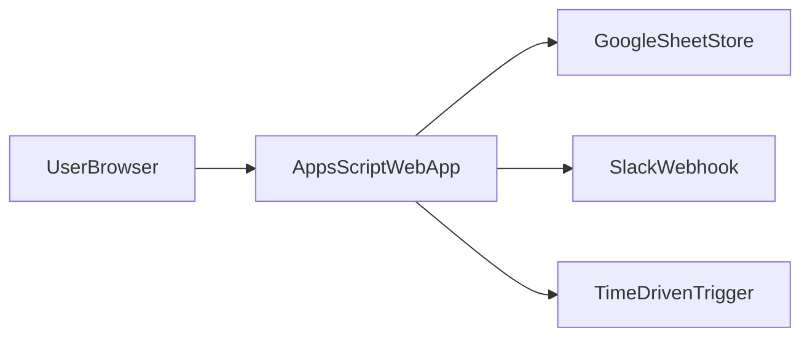

# EV Charging

EV Charging is a lightweight internal web app for managing EV charger usage and reservations at Company.

## Core user flows
- **Charge now**: view chargers, start a session, end session.
- **Reserve**: book next available slots and manage upcoming reservations.
- **Check-in**: check in near the reservation start to auto-start charging.

## UI modes
- **Now** (default): operational view for starting a session immediately.
- **Reserve**: shows next available slots and the user’s reservations.

Mobile uses a bottom tab bar and a sticky action bar for primary actions.

## Data model (Google Sheets)
Tabs created by `initSheets()`:
- `chargers`: charger configuration and active session reference.
- `sessions`: active/complete charging sessions.
- `reservations`: upcoming reservations, check-in, and no-show data.
- `config`: key/value settings.

### chargers
- `charger_id`: unique identifier (string/number).
- `name`: display name shown in the UI.
- `max_minutes`: maximum session length for this charger.
- `active_session_id`: current active session ID (blank if free).

### sessions
- `session_id`: unique session ID (UUID).
- `charger_id`: charger used for the session.
- `user_id`: user email of the driver.
- `user_name`: user display name.
- `start_time`: session start timestamp.
- `end_time`: session end timestamp (computed).
- `status`: `active`, `overdue`, or `complete`.
- `active`: boolean flag for active session.
- `overdue`: boolean flag for overdue session.
- `complete`: boolean flag for completed session.
- `reminder_10_sent`: boolean for 10‑minute reminder.
- `reminder_5_sent`: boolean for 5‑minute reminder.
- `reminder_0_sent`: boolean for expiration reminder.
- `overdue_last_sent_at`: timestamp for last overdue reminder.
- `ended_at`: timestamp when session ended.

### reservations
- `reservation_id`: unique reservation ID (UUID).
- `charger_id`: charger reserved.
- `user_id`: user email of the reserver.
- `user_name`: user display name.
- `start_time`: reservation start timestamp (rounded up).
- `end_time`: reservation end timestamp (computed).
- `status`: `active`, `checked_in`, `canceled`, or `no_show`.
- `checked_in_at`: timestamp when user checked in (auto-starts session).
- `no_show_at`: timestamp when reservation was released.
- `no_show_strike_at`: timestamp when a no-show strike was recorded.
- `reminder_5_before_sent`: boolean for 5-minute pre-start reminder.
- `reminder_5_after_sent`: boolean for 5-minute post-start reminder.
- `created_at`: timestamp created.
- `updated_at`: last update timestamp.
- `canceled_at`: timestamp when canceled.

### config
Key/value settings (strings). Common keys:
- `allowed_domain`: Workspace domain allowed to access.
- `admin_emails`: comma-separated list of admin emails.
- `overdue_repeat_minutes`: repeat cadence for overdue reminders.
- `session_move_grace_minutes`: grace period (in minutes) after session end before overdue enforcement.
- `slack_webhook_url`: optional Slack webhook URL.
- `slack_webhook_channel`: optional Slack channel override.
- `slack_bot_token`: optional Slack bot token for DM sending.
- `reservation_advance_days`: max days ahead to reserve.
- `reservation_max_upcoming`: max upcoming reservations per user.
- `reservation_max_per_day`: max reservations per user per day.
- `reservation_gap_minutes`: minimum gap between reservations on same charger.
- `reservation_rounding_minutes`: rounding increment for reservation start times.
- `reservation_checkin_early_minutes`: earliest check-in window.
- `reservation_early_start_minutes`: how early a reserved slot can start if the charger is free.
- `reservation_late_grace_minutes`: no-show grace window.
- `reservation_open_hour`: earliest local hour for same-day booking.
- `reservation_open_minute`: earliest local minute for same-day booking.

## Reservation rules
- Same-day only.
- Max upcoming reservations per user is enforced (default 3).
- Max reservations per day is enforced (default 1).
- No overlapping or near-overlapping reservations on the same charger.
- Slot length equals charger `max_minutes`.
- Start times must match a configured slot start.
- Early start: if the charger is free, a user can start their reservation up to `reservation_early_start_minutes` early (default 90).
- Prior reservation protection: early starts are blocked while a prior reservation is still within its no-show grace window.
- No-show: after `reservation_late_grace_minutes` (default 30), an unused reservation is released and can receive a strike.
- Checked-in reservations: ending a session will auto-mark the matching reservation as `complete`.
- If a checked-in reservation has no matching active session, the UI offers to clear the checked-in reservation.

## Security and authorization
- Deploy the Apps Script web app to **only your Workspace domain** (e.g., `example.com`).
- The server checks the active user’s email domain against `allowed_domain` to restrict access.
- Admin actions are gated by `admin_emails` and hidden in the UI by default.

This provides a lightweight SSO-like gate when used inside an Enterprise Google Workspace.

## Security & secrets hygiene
Never commit secrets or identifiers that grant access. Keep them in **Script Properties** or local `.clasp.json` only.

Do **not** commit:
- API keys or tokens
- Spreadsheet IDs or URLs
- `.clasp.json`
- OAuth credentials

Recommended practices:
- Keep `.clasp.json` in `.gitignore`
- Use `.env` files locally if needed (and ignore them)
- Review `git status` before pushing
- Avoid debug endpoints that expose script IDs or sheet URLs

## Notifications
Slack DM or webhook for reminders and no-show notices, with email fallback if Slack is unavailable.

## Admin capabilities
- Force end active sessions.
- Reset chargers.

Admin actions are hidden under overflow menus in the UI.

## Key scripts
- `apps-script/Code.gs`: server logic, reminders, reservations, availability, notifications.
- `apps-script/index.html`: layout.
- `apps-script/script.html`: UI logic.
- `apps-script/styles.html`: styles.

## Architecture


### Server responsibilities
- Authenticate Workspace users and enforce domain access.
- Read/write Sheets data for chargers, sessions, and reservations.
- Compute availability and enforce reservation rules.
- Send reminder/notification messages via Slack or email fallback.

### Data flow summary
1. User loads the web app (`doGet`) and the UI fetches data with `getBoardData()`.
2. Actions (start session, reserve, check-in) call server APIs via `google.script.run`.
3. Server reads/writes Sheets and returns updated state for the UI to render.
4. Background trigger runs `sendReminders()` and releases no-show reservations.

## Deployment
Apps Script web app deployed within the Google Workspace domain. The reminder trigger runs `sendReminders()` periodically (recommended every 5 minutes).
Before any recommended push to production, run routine backend logic checks using the CLI to validate core flows (sessions, reservations, reminders).

## CLI (local backend mirror)
The CLI runs the same backend rules as `apps-script/Code.gs`, backed by a local JSON store. This makes it easy to test reservation/session logic without Google Apps Script.

Quick start:
```bash
npm run cli -- seed
npm run cli -- board --user alice@example.com
```

Common commands:
- `npm run cli -- init`
- `npm run cli -- seed`
- `npm run cli -- board`
- `npm run cli -- start-session <chargerId>`
- `npm run cli -- end-session <sessionId>`
- `npm run cli -- reserve <chargerId> <startTimeIso>`
- `npm run cli -- update-reservation <reservationId> <chargerId> <startTimeIso>`
- `npm run cli -- cancel-reservation <reservationId>`
- `npm run cli -- check-in <reservationId>`
- `npm run cli -- next-slot`
- `npm run cli -- availability`
- `npm run cli -- timeline <chargerId> [dateIso]`
- `npm run cli -- calendar [startDateIso] [days]`
- `npm run cli -- send-reminders`

Defaults:
- Store path: `data/store.json` (override with `--store`).
- User email: `user@example.com` (override with `--user`).

Recommended pre‑deploy logic check:
```bash
npm run cli -- seed
npm run cli -- board
```
Policy logic check:
```bash
npm run policy-check
```

## Setup
See `SETUP.md` for step-by-step setup and configuration.
